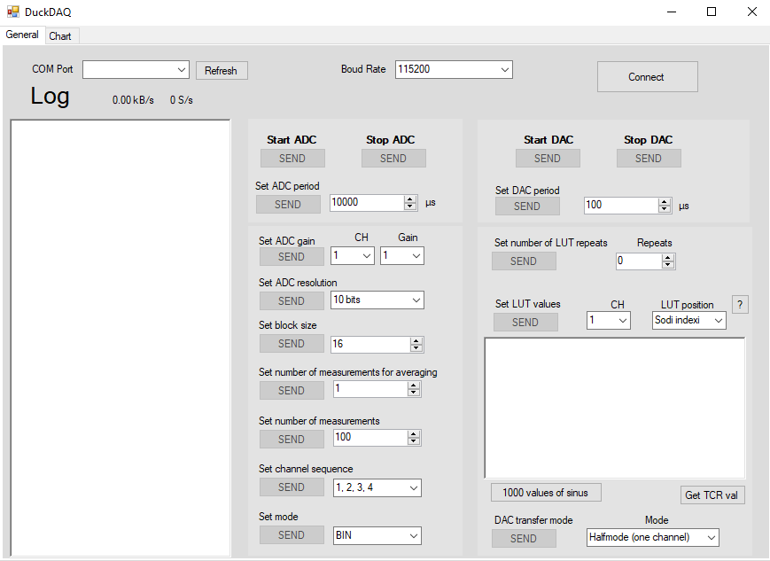
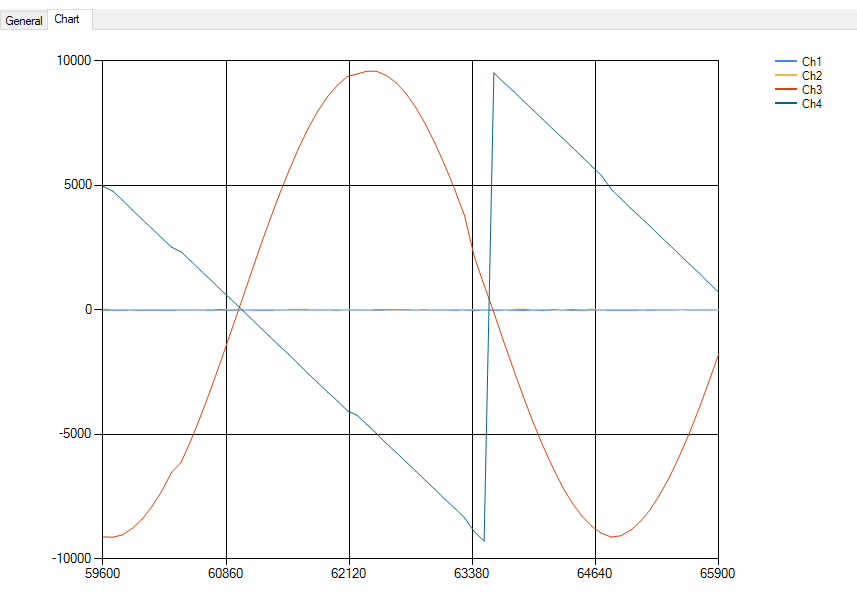

# DuckDAQ WinForms
This application is used for testing the DuckDAQ.
It exposes all the available commands (API) to the user.

### General settings

### Signal display
For testing purposes only. This view could definitely be further improved. Displays all 4 channels at the same time. Image below is a loopback from DAC into ADC (DAQ generating sawtooth and sinus and reading it).

